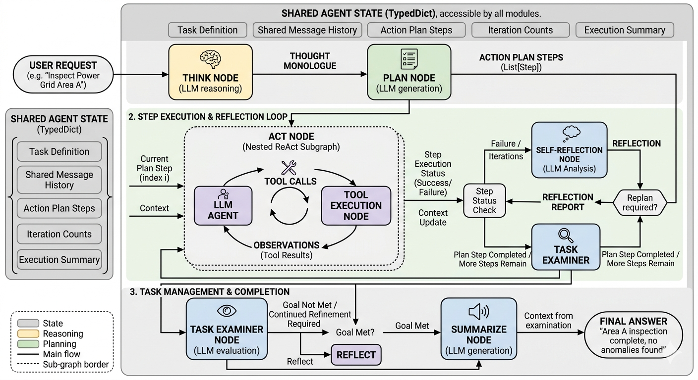
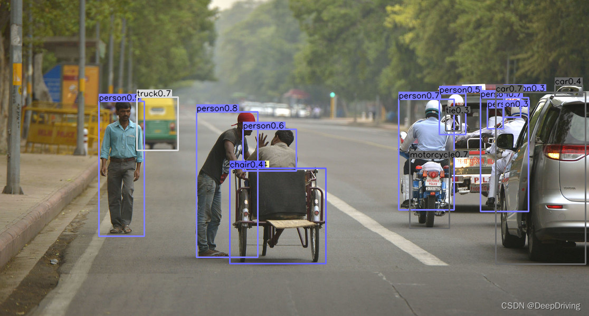

# PGIAgent - Power Grid Inspection Agent

A ROS2 and LangGraph-based intelligent agent system for JetAuto Mecanum Wheel Robot (equipped with Jetson Orin Nano) providing autonomous power grid inspection capabilities.

## Project Overview

PGIAgent is a complete intelligent agent system that integrates large language models (LLMs) with robot hardware capabilities to achieve autonomous power grid inspection tasks. The system adopts a modular design supporting multiple vision models, motion control, and environmental perception tools.


### Core Features

- **🤖 Intelligent Decision Making**: LangGraph-based workflow engine supporting planning, execution, reflection cycles
- **👁️ Multimodal Perception**: Integrated YOLOv11 object detection, Vision Language Model (VLM) scene understanding, OCR text recognition
- **🚗 Safe Navigation**: LiDAR obstacle detection, PID control tracking, safe distance maintenance
- **🔧 Tool-based Architecture**: All capabilities encapsulated as callable tool functions
- **⚡ Jetson Optimization**: TensorRT acceleration and performance optimization for Jetson Orin Nano
- **🔛 Decoupling of Tools and Agent Design**: The tool and agent workflows can be debugged separately for easier inspection.


## System Architecture

```
PGIAgent/
├── config/                  # Configuration Files
│   ├── agent_config.yaml    # Agent configuration
│   ├── model_config.yaml    # Model configuration
│   ├── ros_params.yaml      # ROS parameters
│   └── tools_param.yaml     # ROS2 service tools parameters
├── docs/                    # Documentation
|   ├── architecture.md      # whole thinking
│   └── jetson_setup.md      # Jetson deployment guide
├── launch/                  # ROS2 Launch Files
│   ├── agent.launch.py      # Launch all nodes + agent
│   ├── agent_only.launch.py # Launch agent only
│   └── tools.launch.py      # Launch tool nodes only
├── PGIAgent/                # Python Package
│   ├── agent/               # Agent Core
│   │   ├── agent.py         # Think-Plan-ReAct-Reflect-Examine
│   │   ├── prompts.py       # Prompt templates
│   │   ├── react_agent.py   # ReAct agent
│   │   ├── state.py         # State management
│   │   ├── tools.py         # Tool function encapsulation
│   │   └── __init__.py
│   ├── nodes/               # ROS2 Nodes
│   │   ├── detection_node.py    # Object detection node
│   │   ├── move_node.py         # Motion control node
│   │   ├── obstacle_node.py     # Obstacle detection node
│   │   ├── ocr_node.py          # OCR node
│   │   ├── track_node.py        # Target tracking node
│   │   └── vlm_node.py          # Vision language model node
│   ├── scripts/             # Utility Scripts
│   │   ├── test_agent.py    # Test script
│   │   ├── test_launch.py   # Launch test script
│   │   └── __init__.py
│   └── srv/                 # ROS2 Service Definitions
│       ├── CheckObstacle.srv
│       ├── MoveCommand.srv
│       ├── OCR.srv
│       ├── Track.srv
│       ├── VLMDetect.srv
│       └── YOLODetect.srv
├── resource/                # ROS2 Resource Files
│   └── PGIAgent             # Package marker file
├── scripts/                 # System Scripts
│   └── install_deps.sh      # Dependency installation script
├── .env.example             # Environment variables example
├── .gitignore              # Git ignore file
├── LICENSE                  # MIT License
├── package.xml              # ROS2 package definition (format 3)
├── README.md               # English documentation
├── READMEcn.md             # Chinese documentation
├── requirements.txt        # Python dependencies
└── setup.py               # Python package configuration (ament_python)
```

## Think-Plan-ReAct-Reflect-Examine Workflow

### 1. Overview



When a user provides a task, the model first enters a **Thinking Node** to consider how to accomplish the task and which tools might need to be invoked.

The model then moves to the **Planning Node**, where it outputs a formatted list of steps:
- **Step 1**: [Description of the first step]
- **Step 2**: [Description of the second step]
- **Step 3**: [Description of the third step]

After parsing each step, the model proceeds to an **Act Node** for that step. This node is handled by a new ReAct agent, which completes the step using a **Think-Act-Observation** loop. If the step is completed successfully, the process continues to the next step. If the step fails, the model enters a **Reflect Node** to consider whether to revise the current step or propose a new plan starting from that step.

Once all steps are successfully completed, the model enters an **Examine Node** to evaluate whether the task has been fully accomplished. If the task has not been well completed, the model re-enters the **Reflect Node**; otherwise, it proceeds to the **Summarize Node** to provide a task summary.

### 2. State Management
```python
class PlanActReflectState(TypedDict):
    """Plan-Act-Reflect Agent 状态定义"""
    # 任务相关
    task: str  # 用户任务描述
    
    # 执行计划
    plan: List[str]  # 执行计划步骤列表
    current_step_index: int  # 当前执行的步骤索引
    
    # 历史记录
    past_steps: List[Dict[str, Any]]  # 已完成步骤记录
    
    # ReAct执行相关
    step_messages: Annotated[List[AnyMessage], add_messages]  # ReAct节点的对话历史
    current_step_status: Literal["success", "failure", "pending", "completed"]
    
    # 反思相关
    reflection: Optional[str]  # 反思结果
    reflect_type: Optional[Literal["modify_current", "replan"]]
    
    # 任务完成相关
    task_completed: bool  # 任务是否完成
    final_answer: Optional[str]  # 最终答案
    examine_result: Optional[str]  # 检查结果
    
    # 对话历史 (用于think, plan, reflect, examine节点)
    messages: Annotated[List[AnyMessage], add_messages]
    
    # 迭代控制
    iteration_count: int  # 总迭代次数
    max_iterations: int  # 最大迭代次数

class ReactAgentState(TypedDict):
    """ReAct Agent 状态"""
    # 任务信息
    task: str                          # 原始任务
    current_step: str                  # 当前要执行的步骤
    step_index: int                    # 步骤索引
    total_steps: int                   # 总步骤数
    
    # 执行历史
    messages: List[AnyMessage]          # 对话消息（包含HumanMessage/AIMessage/ToolMessage）
    past_steps: List[Dict]              # 已完成的步骤
    
    # 执行控制
    max_rounds: int                    # 最大循环轮数
    current_round: int                 # 当前轮数
    iteration_count: int                # 迭代次数
    
    # 结果
    step_status: str                   # 步骤执行状态
```

## Tools

### 1. Motion Control
```python
move(velocity=0.2, angle=0.0, seconds=2.0)
```
- `velocity`: Movement speed (m/s), positive for forward, negative for backward
- `angle`: Steering angle (degrees), 0 for straight, positive for left turn, negative for right turn
- `seconds`: Movement duration (seconds)

### 2. YOLO Object Detection
```python
yolo_detect(threshold=0.8)
```
- `threshold`: Confidence threshold (0.0-1.0)
- Returns: Object list, distances, position descriptions

### 3. Vision Language Model Scene Understanding
```python
VLM_detect()
```
- Returns: Detailed scene description

### 4. Target Tracking
```python
track(target="person")
```
- `target`: Tracking target ("person", "electric_box", "transformer")
- Returns: Tracking result

### 5. Obstacle Detection
```python
check_obstacle()
```
- Returns: Safe direction, minimum obstacle distance, safe sectors

### 6. OCR Text Recognition
```python
ocr()
```
- Returns: Recognized text list and confidence scores

## Tool Nodes Implementation

### Overview

The system provides 6 ROS2 tool nodes, each implementing a specific capability as a callable ROS2 service. These nodes are the concrete implementation behind the tool interfaces described above. All nodes follow a similar pattern: subscribe to relevant sensor data, process it, and provide results via ROS2 service calls.

### 1. Detection Node (YOLO Object Detection)



**Service**: `/pgi_agent/detect`

**Implementation Details**:
- Subscribes to RGB and Depth camera topics (`/depth_cam/rgb/image_raw`)
- Uses YOLOv11 model for object detection with TensorRT acceleration support
- **Calculates distance using depth data** at object center point (median of 5x5 region)
- Returns object names, distances, and position descriptions (left/center/right + top/middle/bottom)

**Key Parameters**:
- `model_path`: Path to YOLO model weights
- `engine_path`: Path to TensorRT engine (for GPU acceleration)
- `img_size`: Input image size (default 320)
- `conf_threshold`: Confidence threshold (default 0.8)

**Code Flow**:
```
1. Receive service request with threshold parameter
2. Get latest RGB and Depth frames from subscribers
3. Run YOLO inference on RGB frame
4. For each detected object:
   - Calculate center point (cx, cy)
   - Get depth at center from depth frame
   - Generate position description based on pixel location
5. Return lists of objects, distances, positions
```

### 2. Move Node (Motion Control)

**Service**: `/pgi_agent/move`

**Implementation Details**:
- Implements non-blocking motion control using ROS2 timers
- Converts velocity + angle to linear.x + angular.z (Twist message)
- Uses thread-safe state management with locks
- Provides emergency stop capability

**Key Parameters**:
- `default_velocity`: Default speed (m/s), default 0.2
- `default_seconds`: Default movement duration (s), default 2.0
- `angular_scaling`: Angle to angular velocity scaling factor
- `max_velocity`: Maximum allowed speed
- `control_frequency`: Control loop frequency (Hz)

**Code Flow**:
```
1. Receive move request (velocity, angle, seconds)
2. If already moving, reject request (prevent conflicts)
3. Calculate angular velocity: angular_z = angle * angular_scaling
4. Set target end time = current_time + seconds
5. Start control timer (es Twistpublish at control_frequency)
6. Timer callback publishes Twist until end_time reached
7. Publish zero Twist to stop
```

### 3. Obstacle Node (LiDAR Obstacle Detection)

**Service**: `/pgi_agent/check_obstacle`

**Implementation Details**:
- Subscribes to LiDAR scan topic (`/scan`)
- Divides 360° into 8 sectors (45° each)
- Analyzes minimum distance in each sector
- Determines safest direction to move
- Supports safety levels: SAFE, WARNING, DANGER, CRITICAL

**Key Parameters**:
- `safety_distance`: Safe distance threshold (default 0.5m)
- `warning_distance`: Warning distance (default 0.4m)
- `danger_distance`: Danger distance (default 0.3m)
- `angle_resolution`: Sector angle resolution (default 45°)

**Code Flow**:
```
1. Receive obstacle check request
2. Get latest LiDAR scan data (with timeout)
3. Convert scan ranges to numpy array with angles
4. For each sector:
   - Filter points within sector angle range
   - Calculate minimum valid distance
   - Determine if sector is safe (min_distance > safety_distance)
5. Find safest direction:
   - Prefer forward sectors if safe
   - Otherwise find sector with maximum distance
6. Return safe_direction (relative angle), min_distance, sector info
```

### 4. OCR Node (Text Recognition)

**Service**: `/pgi_agent/ocr`

**Implementation Details**:
- Supports two OCR engines: EasyOCR and Tesseract
- Image preprocessing: grayscale conversion, adaptive thresholding, denoising
- Optional ROI (Region of Interest) extraction
- Filters results based on power equipment keywords
- Returns recognized text, confidence scores, and positions

**Key Parameters**:
- `ocr_engine`: OCR engine selection ("easyocr" or "tesseract")
- `languages`: OCR languages (default ['en', 'ch_sim'])
- `confidence_threshold`: Minimum confidence (default 0.5)
- `preprocess_enabled`: Enable image preprocessing
- `roi_enabled`: Enable ROI extraction

**Code Flow**:
```
1. Receive OCR request
2. Get latest RGB frame from subscriber
3. Preprocess image (if enabled):
   - Convert to grayscale
   - Apply adaptive threshold
   - Apply median blur denoising
4. Extract ROI (if enabled)
5. Run OCR engine:
   - EasyOCR: Returns list of (bbox, text, confidence)
   - Tesseract: Returns structured data with bboxes
6. Filter results:
   - Remove low confidence (< threshold)
   - Remove texts not related to power equipment
7. Return texts, confidences, positions
```

### 5. Track Node (Target Tracking)

**Service**: `/pgi_agent/track`

**Implementation Details**:
- Uses **YOLO for target detection** with tracking
- Implements **PID control** for autonomous tracking
- Maintains safe distance to target
- Supports multiple target types: person, electric_box, transformer, car, dog
- State machine: IDLE → SEARCHING → TRACKING → LOST → COMPLETED

**Key Parameters**:
- `target_distance`: Desired tracking distance (default 1.2m)
- `distance_tolerance`: Distance tolerance (default 0.2m)
- `max_tracking_time`: Maximum tracking duration (default 60s)
- `kp_distance`, `kd_distance`: PID parameters for distance
- `kp_angle`, `kd_angle`: PID parameters for angle

**Code Flow**:
```
1. Receive track request with target type
2. Start tracking thread, change state to SEARCHING
3. SEARCHING state:
   - Detect target using YOLO
   - If found, switch to TRACKING
   - If not found, slowly rotate to search
4. TRACKING state:
   - Detect target, get distance and angle
   - If target lost for >5 frames, switch to LOST
   - If reached target distance, switch to COMPLETED
   - Publish PID control commands:
     * linear_vel = kp*error_distance + kd*deriv_distance
     * angular_vel = kp*error_angle + kd*deriv_angle
5. LOST state:
   - Stop robot
   - Wait 1s, then return to SEARCHING
6. COMPLETED/IDLE: Stop tracking thread
```

### 6. VLM Node (Vision Language Model)

**Service**: `/pgi_agent/vlm_detect`

**Implementation Details**:
- Supports multiple VLM providers: Qwen, DeepSeek, OpenAI, Local models
- Image preprocessing: resize to max size, JPEG compression
- Encodes images as base64 for API calls
- Returns **scene description** for scenarios where YOLO can not handle, detected objects, scene type

**Key Parameters**:
- `provider`: VLM provider selection
- `model`: Model name (e.g., "qwen-vl-max")
- `api_key`: API authentication key
- `max_tokens`: Maximum response tokens
- `image_quality`: Image quality level ("high" or "low")
- `timeout`: API call timeout (seconds)

**Code Flow**:
```
1. Receive VLM detection request
2. Get latest RGB frame from subscriber
3. Preprocess image:
   - Resize if larger than max_image_size
   - Further compress if quality="low"
4. Encode image to JPEG, then base64
5. Build prompt for scene analysis
6. Call VLM API with image and prompt
7. Parse response:
   - Extract scene type
   - Identify objects mentioned
   - Generate detailed analysis
8. Return description, objects, scene_type
```

## Launch System

### Why Launch Files?

ROS2 launch files serve several critical purposes:

1. **Process Management**: Launch files allow you to start multiple nodes with a single command, rather than manually starting each process
2. **Parameter Management**: Centralized configuration of node parameters across the system
3. **Dependency Handling**: Ensure nodes start in the correct order based on dependencies
4. **Remapping**: Map generic topic names to specific hardware topics
5. **Environment Setup**: Configure environment variables like ROS_DOMAIN_ID

### Startup Sequence

The project provides three launch files for different use cases:

#### 1. `agent.launch.py` - Full System Launch
Starts all 6 tool nodes plus the agent node:
```
1. move_node (movement control)
2. detection_node (YOLO detection)  
3. vlm_node (vision language model)
4. track_node (target tracking)
5. obstacle_node (LiDAR obstacle detection)
6. ocr_node (text recognition)
7. agent_node (intelligent agent)
8. task_manager_node (task management)
```

#### 2. `tools.launch.py` - Tool Nodes Only
Starts only the 6 tool nodes for testing/debugging:
```
1. move_node
2. detection_node
3. vlm_node
4. track_node
5. obstacle_node
6. ocr_node
7. service_tester_node (optional)
```

#### 3. `agent_only.launch.py` - Agent Only
Starts only the agent (assuming tools are already running):
```
1. agent_node
2. task_manager_node
3. web_interface_node (optional)
```

**Recommended Startup Order**:
```
# Terminal 1: Start hardware drivers (camera, LiDAR, etc.)
# Terminal 2: Start tool nodes
ros2 launch PGIAgent tools.launch.py use_simulation:=true

# Terminal 3: Start agent (after tools are ready)
ros2 launch PGIAgent agent_only.launch.py

# Or start everything at once:
ros2 launch PGIAgent agent.launch.py use_simulation:=true
```

### Multi-Process vs Multi-Threading

Each ROS2 node runs as a **separate process** by default. This provides:

- **Process Isolation**: One node crashing doesn't affect others
- **Resource Management**: Each process has its own memory space
- **Parallel Execution**: True parallelism across CPU cores

Inside each node, **multi-threading** is used for specific purposes:

| Node | Threading Model | Purpose |
|------|-----------------|---------|
| `move_node` | Single thread + timer | Non-blocking motion control using ROS2 timer |
| `detection_node` | MultiThreadedExecutor | Concurrent service requests, image callbacks |
| `vlm_node` | MultiThreadedExecutor | Concurrent service requests, image callbacks |
| `track_node` | Separate tracking thread + callbacks | Background tracking loop, responsive to stop commands |
| `obstacle_node` | MultiThreadedExecutor | Concurrent service requests, scan callbacks |
| `ocr_node` | MultiThreadedExecutor (4 threads) | Concurrent OCR processing |
| `agent_node` | Event-driven | Single-threaded LangGraph workflow |

**Key Implementation Details**:

1. **Tool nodes use `MultiThreadedExecutor`**:
   ```python
   executor = MultiThreadedExecutor()
   executor.add_node(node)
   executor.spin()
   ```
   This allows multiple service requests to be processed concurrently.

2. **Image callbacks run in separate threads**: All camera subscriptions have their own callback threads, ensuring frame capture doesn't block service processing.

3. **Tracking node uses a dedicated thread**: The tracking loop runs in a separate thread (`Thread(target=self._tracking_loop)`) to maintain responsive tracking while accepting stop commands.

4. **Thread-safe mechanisms**: Nodes use `threading.Lock()` and `threading.Event()` for thread-safe state management.

### Launch File Parameters

Common parameters across launch files:

| Parameter | Description | Default |
|-----------|-------------|---------|
| `ros_domain_id` | ROS2 domain ID | 0 |
| `use_simulation` | Use simulation mode | true |
| `ros_params` | Path to ROS parameters file | config/ros_params.yaml |
| `agent_config` | Path to agent config | config/agent_config.yaml |
| `model_config` | Path to model config | config/model_config.yaml |

Example usage:
```bash
# Start with simulation mode
ros2 launch PGIAgent agent.launch.py use_simulation:=true

# Start with real hardware
ros2 launch PGIAgent agent.launch.py use_simulation:=false

# Start with custom parameters
ros2 launch PGIAgent agent.launch.py ros_domain_id:=5 max_iterations:=30
```

## In The Future

**🌐 Cloud/Local Hybrid**:  
Add a function to the thinking node in the main diagram to **determine task complexity**.  
If the task is relatively simple, consider using a small-parameter model deployed locally (e.g., 3B, 7B, etc.) to complete the task; if the task is difficult, use a cloud-based large model.  

**Challenges**:  
1. The current tool node operation method uses **multi-processing**, which has **high resource consumption**. However, since only one tool is called at a time, we can subscribe directly to the corresponding topics when calling tools, bypassing the multi-processing of ROS2 services.  
2. Small models may not natively support tool calling, requiring design using other agent frameworks.  

**🔧 I/O Tools**:  
Add tools for reading and writing files.

**📚 Building Database And RAG**:  
Domain-specific fine-tuning of cloud-based large models is impractical. A power inspection knowledge database can be established, and Agentic RAG technology can be used to enable large models to fill knowledge gaps.
